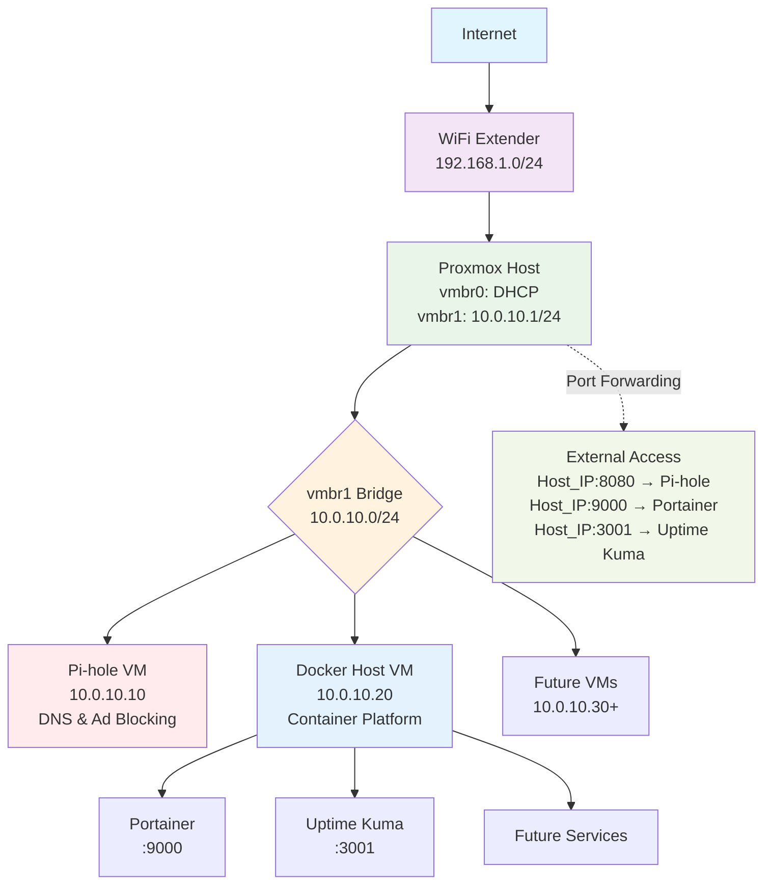
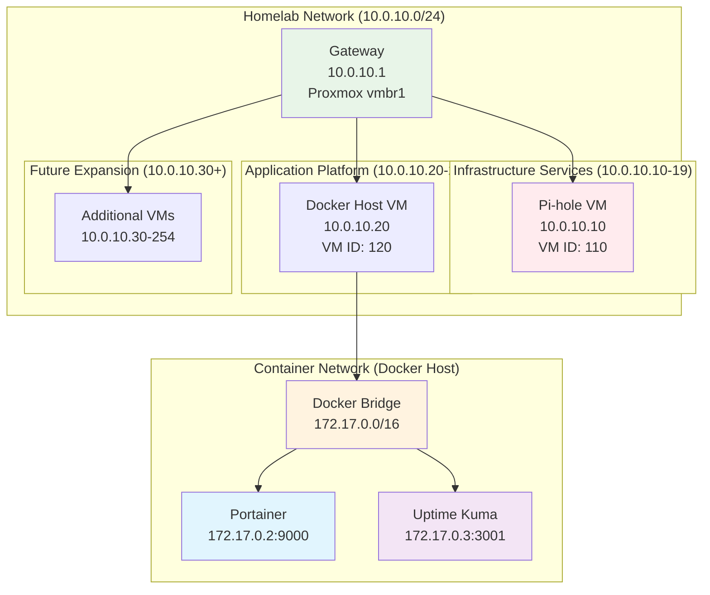
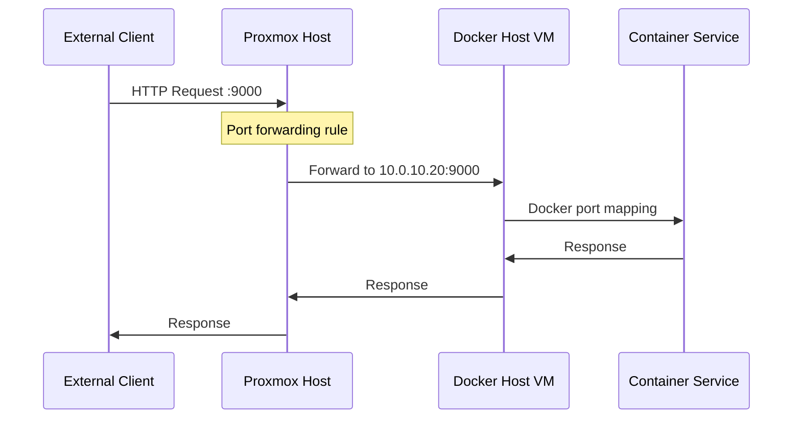
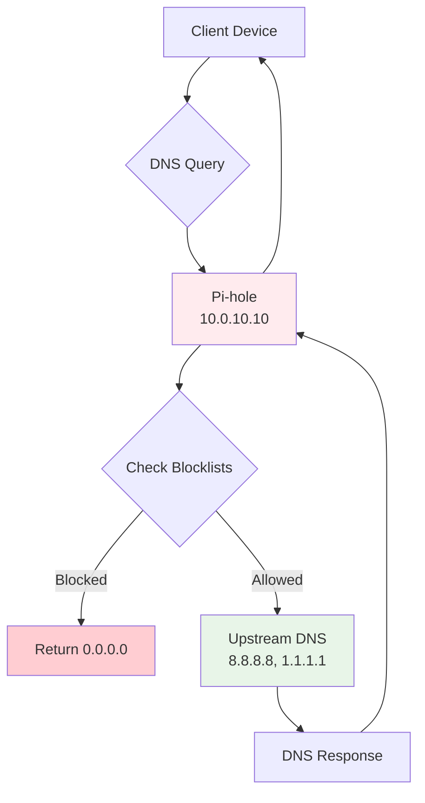
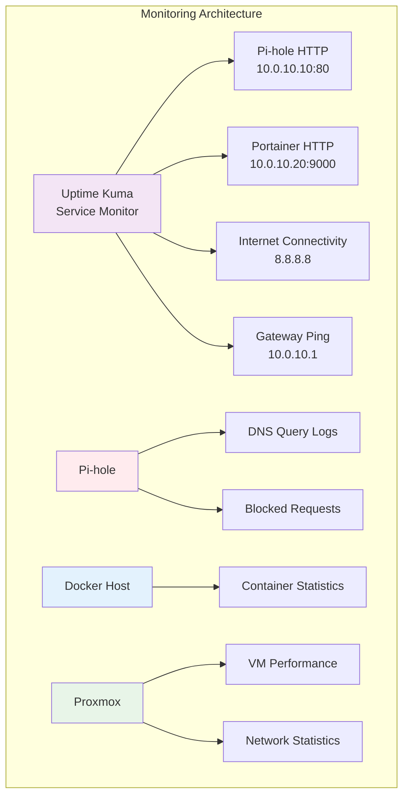
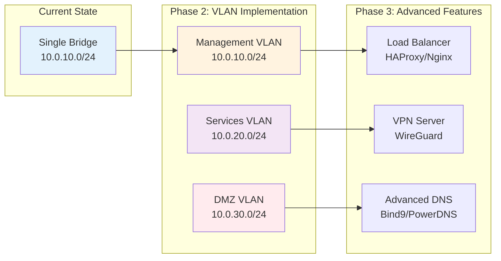

# Network Architecture and Topology

This document provides detailed network architecture diagrams and explanations for the homelab infrastructure.

## High-Level Network Overview



## Physical Network Layer

### Hardware Components

```
┌─────────────────────────────────────────────────────────────┐
│                    Physical Infrastructure                  │
├─────────────────────────────────────────────────────────────┤
│                                                             │
│  Internet Provider                                          │
│        │                                                    │
│        ▼                                                    │
│  ┌─────────────────┐                                        │
│  │  WiFi Extender  │  ◄─── Main Router/Modem                │
│  │  192.168.1.1/24 │                                        │
│  │  DHCP Server    │                                        │
│  └─────────┬───────┘                                        │
│            │ Ethernet                                       │
│            ▼                                                │
│  ┌─────────────────────────────────────────────────────────┐│
│  │           HP EliteDesk Mini G2                          ││
│  │  ┌──────────────────────────────────────────────────────┤│
│  │  │              Proxmox VE Host                         ││
│  │  │  CPU: Intel i7-8700 (6 cores, 23.2GHz)               ││
│  │  │  RAM: 8GB DDR4                                       ││
│  │  │  Storage: 256GB SSD                                  ││
│  │  │  Network: Gigabit Ethernet                           ││
│  │  └──────────────────────────────────────────────────────││
│  └─────────────────────────────────────────────────────────┘│
└─────────────────────────────────────────────────────────────┘
```

### Network Specifications

| Component | Specification | Purpose |
|-----------|---------------|---------|
| **WiFi Extender** | 192.168.1.0/24 network | Internet connectivity, DHCP |
| **Physical Interface** | Gigabit Ethernet | Connection to WiFi extender |
| **Proxmox Host** | HP EliteDesk Mini G2 | Virtualization platform |

## Proxmox Network Layer

### Bridge Configuration

```
Proxmox Host Network Interfaces:
┌─────────────────────────────────────────────────────────────┐
│                      Proxmox Host                           │
│                                                             │
│  ┌─────────────────┐    ┌─────────────────────────────────┐ │
│  │      vmbr0      │    │            vmbr1                │ │
│  │  External Bridge │    │        Internal Bridge         │ │
│  │                 │    │                                 │ │
│  │ Connected to:   │    │ Configuration:                  │ │
│  │ - enp0s3 (phys) │    │ - No physical ports             │ │
│  │ - WiFi Extender │    │ - Static IP: 10.0.10.1/24       │ │
│  │ - DHCP from ISP │    │ - NAT to vmbr0                  │ │
│  │                 │    │ - IP Forwarding enabled         │ │
│  └─────────────────┘    └─────────────────────────────────┘ │
│           │                           │                     │
│           │                           │                     │
│  ┌──────────────────────────────────────────────────────────┤
│  │                 NAT & Routing                            │
│  │  - IP Forward: Enabled                                   │
│  │  - MASQUERADE: 10.0.10.0/24 → vmbr0                      │
│  │  - Port Forward: External → Internal services            │
│  └──────────────────────────────────────────────────────────│
└─────────────────────────────────────────────────────────────┘
```

### Network Interface Configuration

```bash
# /etc/network/interfaces
source /etc/network/interfaces.d/*

# Loopback interface
auto lo
iface lo inet loopback

# External bridge (connected to WiFi extender)
auto vmbr0
iface vmbr0 inet dhcp
        bridge-ports enp0s3
        bridge-stp off
        bridge-fd 0
        # External connectivity and internet access

# Internal homelab bridge
auto vmbr1
iface vmbr1 inet static
        address 10.0.10.1/24
        bridge-ports none
        bridge-stp off
        bridge-fd 0
        # Enable IP forwarding for internet access via NAT
        post-up echo 1 > /proc/sys/net/ipv4/ip_forward
        post-up iptables -t nat -A POSTROUTING -s '10.0.10.0/24' -o vmbr0 -j MASQUERADE
        post-down iptables -t nat -D POSTROUTING -s '10.0.10.0/24' -o vmbr0 -j MASQUERADE
```

## Virtual Machine Network Layer

### VM Network Topology



### IP Address Allocation Schema

| Range | Purpose | Status | Examples |
|-------|---------|--------|----------|
| **10.0.10.1** | Gateway (Proxmox vmbr1) | Reserved | 10.0.10.1 |
| **10.0.10.2-9** | Reserved for infrastructure | Reserved | Future network services |
| **10.0.10.10-19** | DNS & Core Services | Active | 10.0.10.10 (Pi-hole) |
| **10.0.10.20-29** | Application Platform | Active | 10.0.10.20 (Docker Host) |
| **10.0.10.30-49** | Development Services | Available | Test environments |
| **10.0.10.50-99** | User Services | Available | Personal applications |
| **10.0.10.100-199** | DHCP Pool (Future) | Planned | Dynamic allocation |
| **10.0.10.200-254** | Temporary/Testing | Available | Short-term use |

### VM Network Configuration Details

#### Pi-hole VM (10.0.10.10)
```yaml
Network Configuration:
  Interface: ens18
  Method: Static
  IP Address: 10.0.10.10/24
  Gateway: 10.0.10.1
  DNS Servers: 8.8.8.8, 1.1.1.1
  Domain: homelab.local (future)
  
Services:
  - DNS Server (Port 53 TCP/UDP)
  - Web Interface (Port 80 HTTP)
  - DHCP Server (Port 67 UDP) - Future
```

#### Docker Host VM (10.0.10.20)
```yaml
Network Configuration:
  Interface: ens18  
  Method: Static
  IP Address: 10.0.10.20/24
  Gateway: 10.0.10.1
  DNS Servers: 10.0.10.10, 8.8.8.8
  Domain: homelab.local (future)
  
Services:
  - Portainer (Port 9000 HTTP)
  - Uptime Kuma (Port 3001 HTTP)
  - Docker Daemon (Port 2376 TLS)
  - SSH (Port 22)
```

## Container Network Layer

### Docker Network Architecture

```
Docker Host VM (10.0.10.20)
┌──────────────────────────────────────────────────────────────┐
│                    Docker Networking                         │
│                                                              │
│  ┌────────────────────────────────────────────────────────┐  │
│  │              Default Bridge Network                    │  │
│  │                 172.17.0.0/16                          │  │
│  │                                                        │  │
│  │  ┌─────────────────┐    ┌───────────────────────────┐  │  │
│  │  │   Portainer     │    │       Uptime Kuma         │  │  │
│  │  │   172.17.0.2    │    │       172.17.0.3          │  │  │
│  │  │   Port: 9000    │    │       Port: 3001          │  │  │
│  │  └─────────────────┘    └───────────────────────────┘  │  │
│  └────────────────────────────────────────────────────────┘  │
│                                                              │
│  ┌────────────────────────────────────────────────────────┐  │
│  │            Port Mapping to Host                        │  │
│  │  Host:9000 → Container:9000 (Portainer)                │  │
│  │  Host:3001 → Container:3001 (Uptime Kuma)              │  │
│  └────────────────────────────────────────────────────────┘  │
└──────────────────────────────────────────────────────────────┘
```

### Service Communication Flow



## External Access Layer

### Port Forwarding Configuration

```
External Access Flow:
┌─────────────────────────────────────────────────────────────┐
│                  External Clients                           │
│         (Any device on WiFi extender network)               │
└─────────────────────┬───────────────────────────────────────┘
                      │
                      ▼
┌─────────────────────────────────────────────────────────────┐
│              Proxmox Host (iptables NAT)                    │
│                                                             │
│  External Port → Internal Service Mapping:                  │
│  ┌───────────────────────────────────────────────────────┐  │
│  │ :8080 → 10.0.10.10:80   (Pi-hole Admin)               │  │
│  │ :9000 → 10.0.10.20:9000 (Portainer)                   │  │
│  │ :3001 → 10.0.10.20:3001 (Uptime Kuma)                 │  │
│  └───────────────────────────────────────────────────────┘  │
└─────────────────────┬───────────────────────────────────────┘
                      │
                      ▼
┌─────────────────────────────────────────────────────────────┐
│                Homelab Internal Network                     │
│                    10.0.10.0/24                             │
└─────────────────────────────────────────────────────────────┘
```

### iptables Rules Summary

```bash
# NAT table rules for port forwarding
iptables -t nat -A PREROUTING -i vmbr0 -p tcp --dport 8080 -j DNAT --to 10.0.10.10:80
iptables -t nat -A PREROUTING -i vmbr0 -p tcp --dport 9000 -j DNAT --to 10.0.10.20:9000  
iptables -t nat -A PREROUTING -i vmbr0 -p tcp --dport 3001 -j DNAT --to 10.0.10.20:3001

# NAT masquerading for outbound traffic
iptables -t nat -A POSTROUTING -s '10.0.10.0/24' -o vmbr0 -j MASQUERADE

# Forward table rules for allowing traffic
iptables -A FORWARD -d 10.0.10.0/24 -j ACCEPT
iptables -A FORWARD -s 10.0.10.0/24 -j ACCEPT
```

## DNS Architecture

### DNS Resolution Flow



### DNS Configuration Hierarchy

```
DNS Resolution Order:
1. Pi-hole (10.0.10.10) - Primary DNS with ad blocking
   ├── Local DNS records (future: homelab.local domain)
   ├── Blocklist filtering (ads, malware, tracking)
   └── Upstream forwarding to:
       ├── Google DNS (8.8.8.8, 8.8.4.4)
       └── Cloudflare DNS (1.1.1.1, 1.0.0.1)

2. Fallback DNS (configured in VMs)
   ├── 8.8.8.8 (Google)
   └── 1.1.1.1 (Cloudflare)
```

## Security Architecture

### Network Segmentation

```
Security Zones:
┌─────────────────────────────────────────────────────────────┐
│                   Internet (Untrusted)                      │
└─────────────────────┬───────────────────────────────────────┘
                      │ Controlled access via WiFi extender
                      ▼
┌─────────────────────────────────────────────────────────────┐
│               External Network Zone                         │
│                WiFi Extender Network                        │
│                  192.168.1.0/24                             │
└─────────────────────┬───────────────────────────────────────┘
                      │ Proxmox host connection
                      ▼
┌─────────────────────────────────────────────────────────────┐
│                DMZ/Management Zone                          │
│                 Proxmox Host                                │
│            (Limited external access)                        │
└─────────────────────┬───────────────────────────────────────┘
                      │ NAT/Firewall boundary
                      ▼
┌─────────────────────────────────────────────────────────────┐
│               Internal/Trusted Zone                         │
│                Homelab Network                              │
│                 10.0.10.0/24                                │
│         (Full internal communication)                       │
└─────────────────────────────────────────────────────────────┘
```

### Firewall Rules Summary

| Direction | Source | Destination | Port | Service | Action |
|-----------|---------|-------------|------|---------|--------|
| **Inbound** | Any | Proxmox:8080 | TCP | Pi-hole Web | DNAT to 10.0.10.10:80 |
| **Inbound** | Any | Proxmox:9000 | TCP | Portainer | DNAT to 10.0.10.20:9000 |
| **Inbound** | Any | Proxmox:3001 | TCP | Uptime Kuma | DNAT to 10.0.10.20:3001 |
| **Outbound** | 10.0.10.0/24 | Any | Any | Internet | MASQUERADE |
| **Internal** | 10.0.10.0/24 | 10.0.10.0/24 | Any | Inter-VM | ACCEPT |

## Performance Considerations

### Network Performance Optimization

```
Optimization Areas:
┌─────────────────────────────────────────────────────────────┐
│                   Physical Layer                            │
│  • Gigabit Ethernet connection                              │
│  • Full-duplex communication                                │
│  • Low latency within homelab                               │
└─────────────────────────────────────────────────────────────┘
┌─────────────────────────────────────────────────────────────┐
│                 Virtualization Layer                        │
│  • VirtIO network drivers for VMs                           │
│  • Bridge mode for optimal performance                      │
│  • No unnecessary network hops                              │
└─────────────────────────────────────────────────────────────┘
┌─────────────────────────────────────────────────────────────┐
│                  Application Layer                          │
│  • Container networking via Docker bridge                   │
│  • Direct port mapping (no additional NAT)                  │
│  • Local container communication                            │
└─────────────────────────────────────────────────────────────┘
```

### Expected Performance Metrics

| Metric | Internal Communication | External Access |
|--------|----------------------|-----------------|
| **Latency** | < 1ms (VM to VM) | 5-10ms (LAN clients) |
| **Throughput** | ~800Mbps (near line rate) | Limited by WiFi extender |
| **DNS Resolution** | < 5ms (Pi-hole cached) | < 20ms (upstream query) |
| **Service Response** | < 100ms (typical web UI) | < 200ms (via port forward) |

## Monitoring and Observability

### Network Monitoring Points



### Key Monitoring Metrics

| Component | Metrics Monitored | Alerting Threshold |
|-----------|------------------|-------------------|
| **Network Connectivity** | Ping response time, packet loss | > 100ms latency, > 5% loss |
| **DNS Performance** | Query response time, blocked queries | > 50ms response, service down |
| **Service Availability** | HTTP response codes, response time | Non-200 status, > 5s response |
| **Container Health** | CPU usage, memory usage, restart count | > 80% resources, restart events |

## Future Network Enhancements

### Planned Improvements



### VLAN Segmentation Plan

| VLAN ID | Network | Purpose | Services |
|---------|---------|---------|----------|
| **VLAN 10** | 10.0.10.0/24 | Management & Core | Proxmox, Pi-hole, monitoring |
| **VLAN 20** | 10.0.20.0/24 | Application Services | Web apps, databases, containers |
| **VLAN 30** | 10.0.30.0/24 | DMZ/Public | Reverse proxy, public services |
| **VLAN 40** | 10.0.40.0/24 | Development/Test | Test environments, CI/CD |

### Advanced Features Roadmap

1. **SSL/TLS Termination**
   - Reverse proxy with automatic SSL certificates
   - Internal CA for self-signed certificates

2. **Load Balancing**
   - HAProxy for high availability
   - Service discovery integration

3. **VPN Access**
   - WireGuard VPN server
   - Secure remote access to homelab

4. **Advanced Monitoring**
   - Prometheus metrics collection
   - Grafana dashboards
   - AlertManager notifications

## Troubleshooting Network Issues

### Common Network Problems

| Problem | Symptoms | Diagnosis | Solution |
|---------|----------|-----------|----------|
| **VM No Internet** | Can't reach external sites | Check gateway, DNS, NAT | Verify IP forwarding, NAT rules |
| **External Access Fails** | Services unreachable from outside | Port forwarding not working | Check iptables rules, service status |
| **DNS Not Working** | Can't resolve domain names | Pi-hole down or misconfigured | Restart Pi-hole, check upstream DNS |
| **Inter-VM Communication** | VMs can't reach each other | Bridge/routing issue | Verify vmbr1 config, firewall rules |

### Network Diagnostic Commands

```bash
# Test connectivity from Proxmox host
ping 10.0.10.10  # Pi-hole
ping 10.0.10.20  # Docker host
ping 8.8.8.8     # Internet

# Check bridge status
brctl show
ip addr show vmbr1

# Verify NAT rules
iptables -t nat -L -n -v

# Test port forwarding
netstat -tlnp | grep -E ':8080|:9000|:3001'

# Monitor network traffic
tcpdump -i vmbr1 -n
```

## Related Documentation

- [Network Configuration Setup](../setup/02-network-configuration.md)
- [Service Architecture Overview](service-overview.md)
- [Troubleshooting Network Issues](../troubleshooting/common-issues.md)
- [Performance Monitoring](../runbooks/monitoring.md)
