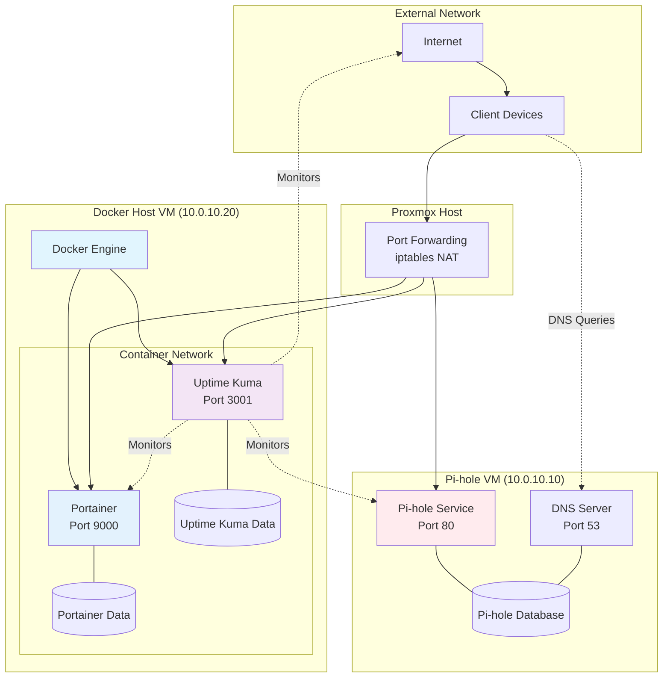
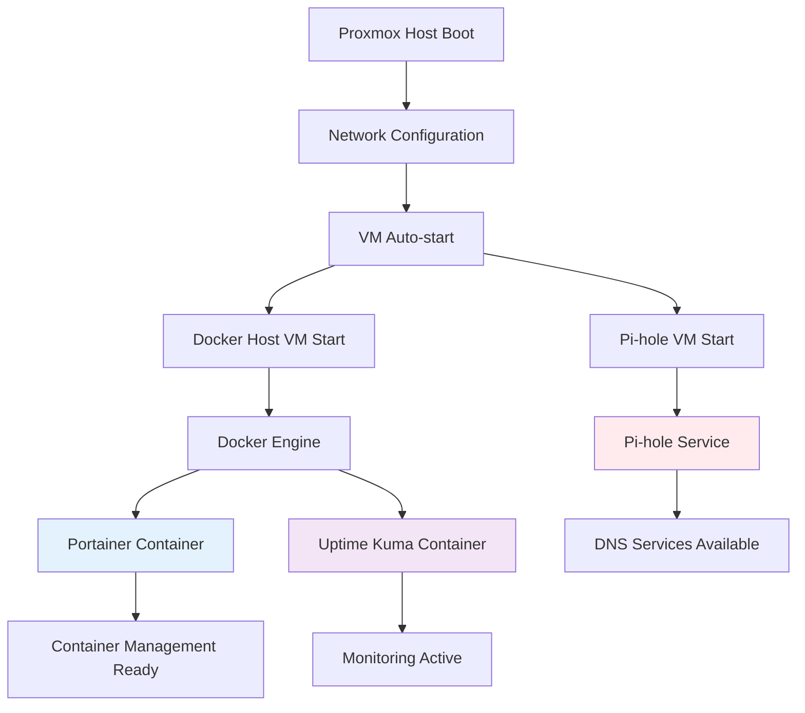
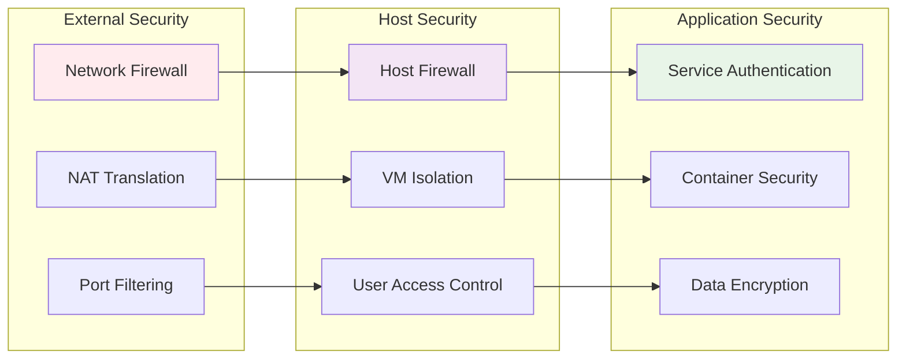

# Service Architecture Overview

This document provides a comprehensive overview of all services running in the homelab environment, their relationships, and architectural decisions.

## Service Architecture Diagram



## Core Services

### Pi-hole (DNS & Ad Blocking)

**Purpose**: Network-wide DNS filtering and ad blocking
**Location**: Dedicated VM (ID: 110)
**Resources**: 1 CPU core, 1GB RAM, 10GB storage

```yaml
Service Details:
  Type: Native Linux service
  Installation: Shell script installer
  Configuration: /etc/pihole/
  Database: SQLite (/etc/pihole/pihole-FTL.db)
  Web Interface: Lighttpd on port 80
  DNS Server: Pi-hole FTL on port 53
  
Network Configuration:
  Internal IP: 10.0.10.10
  External Access: HOST_IP:8080 → 10.0.10.10:80
  DNS Upstream: 8.8.8.8, 1.1.1.1
  
Key Features:
  - DNS filtering and ad blocking
  - Query logging and statistics
  - Whitelist/blacklist management
  - DHCP server (disabled, future use)
  - Custom DNS records (future)
```

### Portainer (Container Management)

**Purpose**: Docker container management and orchestration
**Location**: Docker container on VM 120
**Resources**: Shared (2 cores, 2GB RAM)

```yaml
Service Details:
  Type: Docker container
  Image: portainer/portainer-ce:latest
  Volumes: portainer_data:/data
  Restart Policy: unless-stopped
  
Network Configuration:
  Container Port: 9000
  Host Port: 9000
  Internal Access: 10.0.10.20:9000
  External Access: HOST_IP:9000
  
Key Features:
  - Docker container management
  - Image and volume management
  - User access control
  - Container logs and statistics
  - Stack deployment via Compose
```

### Uptime Kuma (Service Monitoring)

**Purpose**: Service availability monitoring and alerting
**Location**: Docker container on VM 120
**Resources**: Shared (2 cores, 2GB RAM)

```yaml
Service Details:
  Type: Docker container
  Image: louislam/uptime-kuma:1
  Volumes: uptime-kuma-data:/app/data
  Restart Policy: unless-stopped
  
Network Configuration:
  Container Port: 3001
  Host Port: 3001
  Internal Access: 10.0.10.20:3001
  External Access: HOST_IP:3001
  
Key Features:
  - HTTP/HTTPS monitoring
  - Ping monitoring
  - Service status dashboards
  - Notification integrations
  - Historical uptime data
```

## Service Dependencies

### Dependency Matrix

| Service | Depends On | Provides To | Critical Path |
|---------|------------|-------------|---------------|
| **Pi-hole** | Internet, Gateway | DNS services to all VMs | Critical for DNS resolution |
| **Docker Engine** | Host VM, Kernel | Container runtime | Required for containerized services |
| **Portainer** | Docker Engine | Container management | Non-critical, management tool |
| **Uptime Kuma** | Docker Engine, Network | Monitoring data | Non-critical, monitoring only |

### Service Startup Order



## Data Architecture

### Data Storage Strategy

```
Data Storage Layout (~approximate):
┌─────────────────────────────────────────────────────────────┐
│                    Proxmox Host Storage                     │
│                      256GB SSD                              │
├─────────────────────────────────────────────────────────────┤
│                                                             │
│  Proxmox System (20GB)                                      │
│  ├── Operating System                                       │
│  ├── Proxmox VE                                             │
│  └── ISO Storage                                            │
│                                                             │
│  Pi-hole VM (10GB)                                          │
│  ├── Ubuntu 22.04 LTS (8GB)                                 │
│  ├── Pi-hole Database (500MB)                               │
│  ├── Log Files (1GB)                                        │
│  └── Configuration (500MB)                                  │
│                                                             │
│  Docker Host VM (20GB)                                      │
│  ├── Ubuntu 22.04 LTS (10GB)                                │
│  ├── Docker Images (5GB)                                    │
│  ├── Container Volumes (3GB)                                │
│  │   ├── Portainer Data (1GB)                               │
│  │   └── Uptime Kuma Data (2GB)                             │
│  ├── Container Logs (1GB)                                   │
│  └── System Logs (1GB)                                      │
│                                                             │
│  Available Space (206GB)                                    │
│  ├── VM Backups (50GB allocated)                            │
│  ├── Future VMs (100GB reserved)                            │
│  └── Growth/Overhead (56GB)                                 │
└─────────────────────────────────────────────────────────────┘
```

### Data Persistence

| Service | Data Type | Storage Method | Backup Strategy |
|---------|-----------|----------------|-----------------|
| **Pi-hole** | Configuration, logs, database | VM filesystem | VM snapshots + config export |
| **Portainer** | Configuration, users | Docker volume | Volume backup + compose files |
| **Uptime Kuma** | Monitor configs, historical data | Docker volume | Volume backup + database export |
| **System Logs** | Application and system logs | VM filesystem | Log rotation + VM backups |

## Security Architecture

### Security Layers



### Security Implementation

| Layer | Implementation | Purpose |
|-------|----------------|---------|
| **Network Security** | iptables NAT, port forwarding | Control external access |
| **VM Security** | Isolated VMs, UFW firewall | Contain service failures |
| **Container Security** | Docker isolation, non-root users | Limit container privileges |
| **Application Security** | Strong passwords, HTTPS (future) | Protect service access |
| **Data Security** | Regular backups, access controls | Protect against data loss |

### Access Control Matrix

| Service | Authentication | Authorization | External Access |
|---------|----------------|---------------|-----------------|
| **Pi-hole** | Admin password | Single admin user | Web interface only |
| **Portainer** | Username/password | Role-based access | Full container management |
| **Uptime Kuma** | Username/password | User-based access | Read-only monitoring |
| **SSH (VMs)** | SSH keys/password | User-based sudo | System administration |

## Performance Architecture

### Resource Allocation

```
Resource Distribution:
┌─────────────────────────────────────────────────────────────┐
│                  HP EliteDesk Mini G2                       │
│           Intel i7-8700, 8GB RAM, 256GB SSD                 │
├─────────────────────────────────────────────────────────────┤
│                                                             │
│  Proxmox Host Overhead (25%)                                │
│  ├── CPU: 1 core reserved                                   │
│  ├── RAM: 2GB reserved                                      │
│  └── Storage: 50GB reserved                                 │
│                                                             │
│  Pi-hole VM (18.75%)                                        │
│  ├── CPU: 1 core (25% of available)                         │
│  ├── RAM: 1GB (8% of total)                                 │
│  └── Storage: 10GB (4% of total)                            │
│                                                             │
│  Docker Host VM (37.5%)                                     │
│  ├── CPU: 2 cores (50% of available)                        │
│  ├── RAM: 3GB (12.5% of total)                              │
│  └── Storage: 20GB (8% of total)                            │
│                                                             │
│  Available for Growth (18.75%)                              │
│  ├── CPU: 2 core                                            │
│  ├── RAM: 2GB                                               │
│  └── Storage: 176GB                                         │
└─────────────────────────────────────────────────────────────┘
```

### Performance Monitoring

| Metric | Target | Alert Threshold | Monitoring Method |
|--------|--------|-----------------|-------------------|
| **CPU Usage** | < 60% average | > 80% for 5 minutes | VM monitoring |
| **Memory Usage** | < 70% average | > 85% for 5 minutes | VM monitoring |
| **Disk Usage** | < 80% used | > 90% used | VM monitoring |
| **Network Latency** | < 10ms internal | > 100ms response | Uptime Kuma |
| **Service Response** | < 2s web UI | > 5s response time | Uptime Kuma |

## Integration Architecture

### Service Communication

```mermaid
sequenceDiagram
    participant Client as Client Device
    participant Gateway as Proxmox Gateway
    participant PiHole as Pi-hole
    participant Docker as Docker Host
    participant Monitor as Uptime Kuma
    
    Note over Client,Monitor: Service Discovery
    Client->>PiHole: DNS Query
    PiHole->>Client: DNS Response
    
    Note over Client,Monitor: Service Access
    Client->>Gateway: HTTP Request
    Gateway->>Docker: Port Forward
    Docker->>Client: Service Response
    
    Note over Client,Monitor: Health Monitoring
    Monitor->>PiHole: Health Check
    Monitor->>Docker: Health Check
    Monitor# File: docs/setup/01-proxmox-setup.md

# Proxmox VE Setup and Configuration

This guide covers the initial setup and configuration of Proxmox VE on the HP EliteDesk Mini G2 for homelab use.

## Prerequisites

- HP EliteDesk Mini G2 with at least 8GB RAM
- WiFi extender connection for internet access
- USB drive for Proxmox installation media
- Basic knowledge of virtualization concepts

## Hardware Specifications

### HP EliteDesk Mini G2 Configuration
- **CPU**: Intel Core i5-6500T (4 cores, 2.5GHz)
- **RAM**: 16GB DDR4 (expandable)
- **Storage**: 256GB SSD
- **Network**: Gigabit Ethernet + WiFi
- **Form Factor**: Ultra-small desktop (175mm x 175mm x 34mm)

## Initial Proxmox Installation

### 1. Download Proxmox VE ISO
```bash
# Download the latest Proxmox VE ISO
wget https://www.proxmox.com/en/downloads/proxmox-virtual-environment/iso
```

### 2. Create Installation Media
- Use tools like Rufus (Windows) or `dd` (Linux) to create bootable USB
- Boot from USB and follow installation wizard

### 3. Installation Configuration
During installation, configure:
- **Hostname**: `proxmox-homelab.local`
- **Network**: Configure for your WiFi extender network
- **Root Password**: Use a strong password
- **Email**: Your email for notifications

## Post-Installation Configuration

### 1. Access Web Interface
```bash
# Find Proxmox IP address
ip addr show

# Access web interface at: https://PROXMOX_IP:8006
```

### 2. Configure Package Repositories
```bash
# SSH into Proxmox host
ssh root@PROXMOX_IP

# Disable enterprise repositories (require paid license)
mv /etc/apt/sources.list.d/pve-enterprise.list /etc/apt/sources.list.d/pve-enterprise.list.disabled
mv /etc/apt/sources.list.d/ceph.list /etc/apt/sources.list.d/ceph.list.disabled

# Add community repository (free)
echo "deb http://download.proxmox.com/debian/pve bookworm pve-no-subscription" > /etc/apt/sources.list.d/pve-no-subscription.list

# Update package lists
apt update && apt upgrade -y
```

### 3. Configure Permanent DNS
```bash
# Install resolvconf for permanent DNS
apt install resolvconf -y

# Configure DNS servers
nano /etc/resolvconf/resolv.conf.d/head
```

Add:
```
nameserver 8.8.8.8
nameserver 1.1.1.1
```

Apply configuration:
```bash
resolvconf -u
```

## Storage Configuration

### 1. Review Storage Setup
```bash
# Check available storage
pvesm status

# Typical setup includes:
# - local: Proxmox system files and ISOs
# - local-lvm: VM disk images
```

### 2. Optimize Storage for Small System
```bash
# For systems with limited storage, consider:
# - Thin provisioning for VM disks
# - Regular cleanup of old backups
# - Compression for backup storage
```

## Network Interface Configuration

### 1. Default Bridge (vmbr0)
- Connected to physical network interface
- Provides internet access to VMs
- Usually configured with DHCP from WiFi extender

### 2. Management Network Access
```bash
# Ensure SSH access is enabled
systemctl enable ssh
systemctl start ssh

# Configure firewall if needed
ufw allow ssh
ufw allow 8006/tcp  # Proxmox web interface
```

## Security Hardening

### 1. SSH Configuration
```bash
# Edit SSH configuration
nano /etc/ssh/sshd_config

# Recommended changes:
# PermitRootLogin yes (for initial setup, can disable later)
# PasswordAuthentication yes
# PubkeyAuthentication yes

# Restart SSH
systemctl restart ssh
```

### 2. Firewall Configuration
```bash
# Install and configure UFW
apt install ufw -y

# Allow essential services
ufw allow ssh
ufw allow 8006/tcp  # Proxmox web interface
ufw allow from 10.0.10.0/24  # Allow homelab network

# Enable firewall
ufw enable
```

### 3. Automatic Updates
```bash
# Configure automatic security updates
apt install unattended-upgrades -y
dpkg-reconfigure unattended-upgrades

# Configure update settings
nano /etc/apt/apt.conf.d/50unattended-upgrades
```

## Performance Optimization

### 1. CPU Configuration
- Enable CPU scaling governor for power efficiency
- Configure CPU limits for VMs based on actual needs

### 2. Memory Management
```bash
# Check memory usage
free -h

# Configure swap if needed (for systems with limited RAM)
fallocate -l 2G /swapfile
chmod 600 /swapfile
mkswap /swapfile
swapon /swapfile
echo '/swapfile none swap sw 0 0' >> /etc/fstab
```

### 3. Disk I/O Optimization
- Use VirtIO SCSI for VM disks
- Enable discard/TRIM for SSDs
- Consider cache settings for different workloads

## Backup Configuration

### 1. Local Backup Setup
```bash
# Create backup schedule in Proxmox web interface:
# Datacenter → Backup → Add
# - Storage: local
# - Schedule: Daily at 2:00 AM
# - Mode: Snapshot (for faster backups)
# - Compression: ZSTD (good compression ratio)
```

### 2. Backup Retention Policy
- Keep daily backups for 7 days
- Keep weekly backups for 4 weeks
- Keep monthly backups for 3 months

## Monitoring Setup

### 1. Enable Prometheus Metrics
```bash
# Configure Proxmox to export metrics
# Web interface: Datacenter → Metric Server → Add
# Type: InfluxDB or Prometheus
```

### 2. Log Management
```bash
# Configure log rotation
nano /etc/logrotate.d/proxmox

# Monitor important logs
tail -f /var/log/pve-firewall.log
tail -f /var/log/pvedaemon.log
```

## Troubleshooting Common Issues

### 1. Web Interface Access Issues
```bash
# Restart Proxmox web services
systemctl restart pveproxy
systemctl restart pvedaemon

# Check service status
systemctl status pveproxy
systemctl status pvedaemon
```

### 2. Network Connectivity Issues
```bash
# Check network configuration
ip addr show
ip route show

# Test internet connectivity
ping -c 4 8.8.8.8

# Check DNS resolution
nslookup google.com
```

### 3. Storage Issues
```bash
# Check storage usage
df -h
pvesm status

# Clean up old backups
find /var/lib/vz/dump -name "*.vma*" -mtime +7 -delete
```

## Next Steps

After completing Proxmox setup:
1. [Configure homelab network](02-network-configuration.md)
2. [Create virtual machines](03-vm-creation.md)
3. [Deploy services](04-service-deployment.md)

## Additional Resources

- [Proxmox VE Documentation](https://pve.proxmox.com/pve-docs/)
- [Proxmox VE Community Forum](https://forum.proxmox.com/)
- [Proxmox VE Wiki](https://pve.proxmox.com/wiki/Main_Page)
